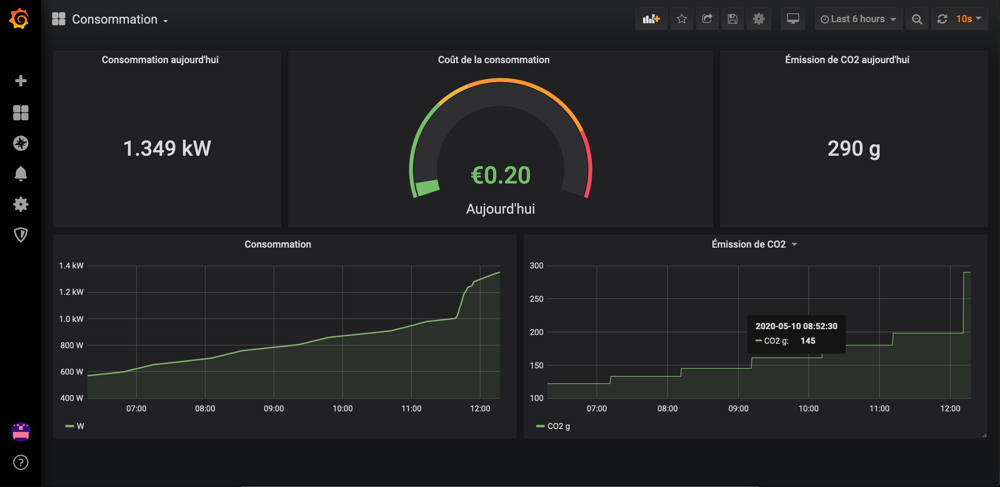

# Atome exporter

Prometheus exporter for Total direct Energie Atome key. The Atome key gives you real-time access to your consumption on their mobile application. It don't really like the app's UI and I want to use alertmanager to get notifications about my consumption.

Here is an example of a grafana dashboard you can create with this exporter:



## How to start it

Set those two environement variables:
```
export ATOME_EXPORTER_ATOME_USERNAME=MY_TOTAL_DIRECT_ENERGIE_USERNAME
export ATOME_EXPORTER_ATOME_PASSWORD=MY_TOTAL_DIRECT_ENERGIE_PASSWORD
```

Then, build and run the exporter:
```
go build -o atome_exporter ./cmd/atome_exporter
./atome_exporter
```

## How to deploy it with prometheus and grafana 

I've created an Ansible playbook which install prometheus, grafana, caddy 2 and the exporter on the same machine.
You can run it on a simple 2.99€ OVHcloud s1-2 public cloud instance. 

To make the project public, I've removed my vault file and my inventory file. So you need to create them.

First, create your inventory file:

```bash
cat > ./deployment/environment/production/hosts <<EOF
atome-stats ansible_host=XX.XX.XX.XX ansible_user=ubuntu ansible_become=true
EOF
```

Then, create your vault file:

```bash
ansible-vault create ./deployment/environment/production/group_vars/all/vault.yml --ask-vault-pass
```

Define your vault password then, put the following vars:

```yaml
vault_grafana_security_admin_user: MY_USER
vault_grafana_security_admin_password: MY_PASSWORD
vault_atome_exporter_api_user: MY_TOTAL_DIRECT_ENERGIE_USERNAME
vault_atome_exporter_api_password: MY_TOTAL_DIRECT_ENERGIE_PASSWORD
vault_grafana_domain_name: MY_DOMAIN
```

Finally, run:

```bash
make deploy
```